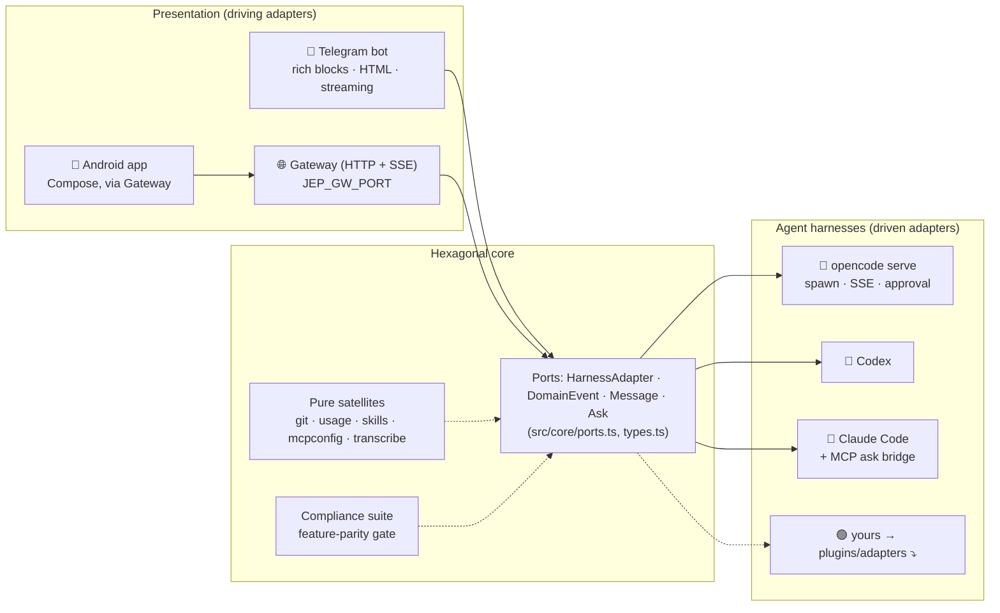

<div align="center">


# jep

**One interface for every coding agent. On whatever device you're on.**

Coding agents are mostly driven from their own CLIs, each with its own feel,
its own models, its own mobile situation. jep gives you one layer on top: a
single companion experience that speaks the same way to **opencode**, **codex**
and **claude**, reachable from **Telegram** today and the **Android app**,
with any client possible behind the gateway. Your code stays on your machine.

[](package.json)
[](package.json)
[](src/core/harnesses.ts)
[](docs/GATEWAY.md)
[](LICENSE)

<!-- CI badge: paste your GitHub Actions URL once CI exists:
[](https://github.com/<owner>/jep/actions/workflows/ci.yml)
-->

</div>

<!--
HERO IMAGE: the single most important asset. A screenshot that captures the
whole promise in ~5 seconds. Drop real captures from a client here:

docs/images/screens-telegram.png   a Telegram chat: a streamed turn with a
                                   native Stop button, a 💭 thinking line,
                                   collapsible tool calls, a markdown table
docs/images/screens-android.png    an Android chat: the same turn, Compose UI,
                                   the pinned conversation + notifications
docs/images/screens-gateway.png    optional: a web dashboard pixel proof

Pick one wide 16:9 crop (≈1280 wide) for the hero, or a 2-up side-by-side of
the Telegram and Android chats. Everything else goes in the client READMEs
(docs/clients/telegram.md, docs/clients/android.md).
-->

---

## Why jep

Coding agents are built around their own CLIs. Each agent has its own feel, its
own models, and its own story for working away from a desk: Claude Code ships a
polished mobile companion, while opencode and codex meet you at the terminal.
Reaching an agent from another device means bolting a *specific* companion onto
a *specific* harness. That is slow to build, precarious to keep, and duplicated
once per harness. It also never fixes the deeper friction of jumping between
harnesses just to reach a proprietary model or feature, and relearning a
different feel every time you switch.

jep is the shared layer. One harness contract, one set of clients, every agent.

- **🧠 One hexagonal core, every harness.** A single `HarnessAdapter` port
  normalizes each agent, with **opencode** as the flagship and full adapters for
  **Claude Code** and **Codex**. Every client speaks to the same contract, so a
  harness behind the shared layer is reachable from any device.
- **📱 Clients that reach you wherever you are.** A **Telegram bot** with native
  rich-message rendering (tables, collapsible thinking and tool calls, native
  stop buttons, ephemeral permission prompts) and a **Jetpack Compose Android
  app**. The [gateway](docs/GATEWAY.md) is a token-authenticated HTTP + SSE
  door, so a web dashboard, a Slack bot, or a desktop widget can be a client
  just the same.
- **⚡ Live from the first word.** Turns stream into an animated draft: a 💭
  thinking line while the model reasons, tool calls you can expand, and the
  answer tail updating every ~700 ms. Tap **stop** to cut a turn, **steer** to
  replace it.
- **🎙 Speak your prompt.** Voice notes are decoded, transcribed with whisper,
  and land as real prompts, with a receipt of what was *heard* so a misheard
  word is debuggable.
- **🖥 The repo, from your client.** Read-only git screens (status, log, diff,
  paginated against the wire limits), one confirmed **push** action, and
  config-as-data toggles for **MCP servers and skills**, one line touched per
  switch.
- **💸 Spend you can see, not guess.** A usage screen and a pinned cost chip
  report what the harness itself priced every turn: tokens, model, USD.
  **Free by default** until you explicitly pick a paid model.
- **🔒 Private by default.** Everything runs on your machine: sessions live in
  an isolated data home (your CLI's store is untouched), and the daemon serves
  Tailscale or your LAN. Self-hosted and account-free.

---

## Quick start

Two minutes to your first agent reply from wherever you are.

### Requirements

- **Node ≥ 26** (the daemon runs native TypeScript, no build step)
- at least one agent CLI installed: **opencode**, **codex**, or **claude**

### 1. Install

```sh
git clone https://github.com/tinybig-ai/jep.git && cd jep
npm install
```

### 2. Run the daemon

```sh
# point at a workspace (defaults to the current directory)
export JEP_WORKSPACES="$HOME/your-project"

npm run tg
```

> On macOS, `sh scripts/install.sh` installs it as a **launchd daemon** that
> survives reboots, crashes and full-disk-access quirks. See
> [docs/PROCESSES.md](docs/PROCESSES.md). For a quick dev loop, `npm run tg`
> is all you need.

### 3. Pick a client

jep runs as one daemon and reaches you through whatever client you prefer.
Each client has its own setup and command surface:

- **Telegram bot** → [clients/telegram](docs/clients/telegram.md):
  pair it from your chat, then text it. Rich messages, voice notes, git and
  usage screens, and a streaming stop/steer loop.
- **Android app** → [clients/android](docs/clients/android.md):
  Point it at the gateway, pair, and you have conversations, streaming turns,
  and notifications in a native Compose client.
- **Anything else** → the [gateway](docs/GATEWAY.md): a token-authenticated
  HTTP + SSE door that any client (web dashboard, Slack bot, desktop widget)
  can speak to.

Client setup lives in those READMEs so the top of this file stays the same
whichever client you choose.

---

## How it works

jep is a **hexagonal / ports-and-adapters** system. The core defines one
contract (`HarnessAdapter`, domain events, and message types) and two kinds of
adapter plug into it.



<!--
ARCHITECTURE IMAGE: optional. The Mermaid diagram above always renders; supply
a polished image if you want something more brandable.

docs/images/architecture.png, a three-column rendering of the same graph:
[Client adapters: Telegram bot · Gateway (HTTP+SSE) · Android app] → [Hexagonal
core · ports + compliance] → [Harness adapters: opencode · codex · claude].
Keep the exact node labels from the Mermaid graph.
-->

### The hexagon in practice

- **The core doesn't know Telegram or opencode.** Frontends see only the port
  type, a `provider/model` string, a `Message`, an `AskRequest`. Harnesses emit
  `DomainEvent`s; the client decides how to present them.
- **Every reply degrades, never fails.** The render pipeline is
  *Rich Message blocks → Telegram HTML (box-drawn tables) → plain text*, and a
  rejected parse retries without markup. A fancy feature breaking looks a little
  worse; it doesn't crash the bot.
- **State is isolated, credentials are shared.** The daemon runs each harness in
  its own `XDG_DATA_HOME` so your CLI's sessions are untouchable, but mirrors
  your `auth.json` in so every model in the picker actually runs.
- **Turn ownership follows the caller.** The session started it is the session
  that owns it. One process, shared ports, no cross-talk.

Rules and rationales live in [docs/PHILOSOPHY.md](docs/PHILOSOPHY.md).

---

## Write your own integration

This is the whole point of the architecture: **the seam is small, provable, and
the same on both sides.**

### Add an agent harness (driven side)

Implement `HarnessAdapter` (`src/core/ports.ts`) for your favorite agent, it
doesn't need to run over HTTP, or even be a server.

```ts
// src/adapters/my-harness.ts
import type { HarnessAdapter } from "../core/ports.ts"
import type { DomainEvent, Message, SessionSummary } from "../core/types.ts"

export async function startMyHarness(workspace: string): Promise<HarnessAdapter> {
  const proc = spawn(`my-harness serve ${workspace}`)
  return {
    id: "my-harness",
    workspace,
    endpoint: proc.url,
    health: async () => ({ healthy: true, version: "0.1.0" }),
    createSession: async (title): Promise<SessionSummary> => /* … */,
    prompt: async (sessionID, text, { signal, model, filePaths }): Promise<Message> => {
      /* run the actual turn */
    },
    messages: async (sessionID) => /* history */,
    abort: async (sessionID) => /* cancel the in-flight turn */,
    respondAsk: async (sessionID, askID, optionID) => /* answer permission prompts */,
    events: async function* () { yield { type: "server.connected" } /* stream deltas */ },
    close: async () => proc.kill(),
  }
}
```

Register it in the harness registry, **one row, and nothing else**:

```ts
// src/core/harnesses.ts
{ id: "my-harness", icon: "🟢",
  start: (dir) => startMyHarness(dir),
  available: async () => probeCli("my-harness") }
```

Then prove it. jep ships a **compliance suite** (`src/core/compliance.ts`) that
boots your adapter, creates a session, prompts it, reads history back, and
reports a per-method feature-parity matrix, no boilerplate test to write:

```sh
npm run probe:harness -- my-harness
```

Every client is written against the same list, so **full parity for your
harness means every client works, unchanged.**

### Build a new client (driving side)

Telegram and the Android app are just two consumers of the core. The
[gateway](docs/GATEWAY.md) is a thin token-authenticated HTTP + SSE surface over
the *same* ports: sessions, history, prompts, streaming events, asks, usage,
diffs, even a tmux terminal. A web dashboard, a Slack bot, or a desktop widget
is a third consumer behind the same door (`JEP_GW_PORT`), with the full
endpoint reference in [docs/GATEWAY.md](docs/GATEWAY.md).

When a client grows its own surface (commands, screens, flows), document it in
its own README under [docs/clients/](docs/clients/). Adapters can live in this
repo today and in their own repos tomorrow, without touching the core.

---

## Development

```sh
npm install          # dev deps: typescript, @types/node · runtime: undici
npm run check        # tsc typecheck + node --test suite (~1s, no network)
npm run test:e2e     # opt-in: replays fixtures against a REAL harness (~45s)
npm run tg:mock      # replay a Telegram fixture, dump every wire call
```

The rendering pipeline is pure and deterministic (markdown → HTML/rich blocks,
string in, blocks out) so the unit tests pin down escape-ordering, box-table
geometry and streaming safety at every prefix. The full verification ritual and
deploy rules: [docs/PROCESSES.md](docs/PROCESSES.md).

### Repository layout

```
src/
  tg.ts                 composition root (wiring, env, gateway, update loop)
  core/                 hexagonal core: ports, types, compliance, pure satellites
  adapters/             harness adapters: opencode · codex · claude · fcm
  telegram/             the Telegram face: bot · api · renderers · store · pair
  gateway.ts            HTTP/SSE transport for native clients
  importers/ · terminals/   cross-store session import · tmux shell
android/                the native Android client (Kotlin · Jetpack Compose)
docs/                   PHILOSOPHY · GATEWAY · PROCESSES · clients/
```

## Contributing

jep is new, small, and built on a deliberate seam, so the surest way to help is
to **implement the port for a harness you love**, or to **build a client** on
top of the gateway. Issues and PRs welcome:

1. Fork it, branch off `main`, keep changes to one concern.
2. Add or update a unit test; the pure renderers and git grammars make this cheap.
3. `npm run check` green, then open the PR.

Before opening a PR, skim [docs/PHILOSOPHY.md](docs/PHILOSOPHY.md), because
"never move on from a broken state" applies to the bot that runs on people's
devices.

## License

[MIT](LICENSE)

---

<div align="center">

<sub>One layer. Every harness. Runs on your machine.</sub>

</div>