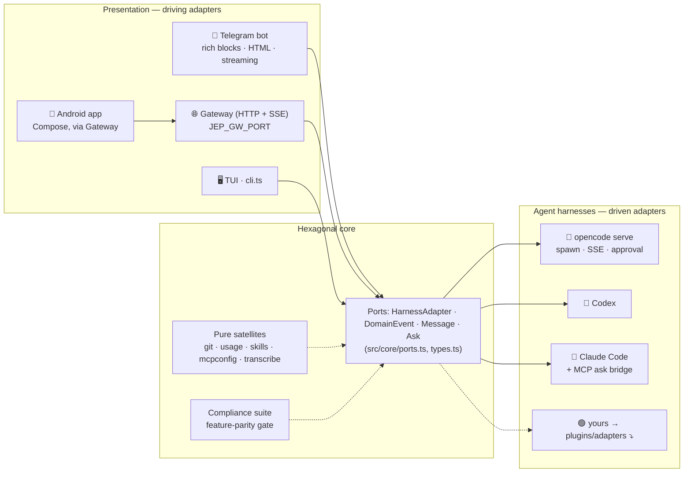

<div align="center">

<!-- LOGO — supply a transparent PNG, square, ~512×512: docs/images/jep.png -->


# jep

**The phone-first control plane for local coding agents.**

Text a prompt from anywhere. Watch the agent *think*, run tools, and stream the
answer back — tables, diffs and code, rendered natively in **Telegram** or the
**Android app** on your phone. Your code never leaves your machine.

[](package.json)
[](package.json)
[](src/core/harnesses.ts)
[](docs/GATEWAY.md)
[](LICENSE)

<!-- CI badge — paste your GitHub Actions URL once CI exists:
[](https://github.com/<owner>/jep/actions/workflows/ci.yml)
-->

</div>

<!--
HERO IMAGE — the single most important asset. A phone mockup, GIF strongly
preferred, that captures the whole promise in ~5 seconds:

docs/images/hero.gif (1080×1080 is Instagram-safe; 720 wide is fine)

Suggested sequence, top to bottom:
1. A Telegram chat: "refactor the queue into a class" ⌨️
2. A live draft appears with a native "Stop" button and a 💭 *thinking…* line
3. Text streams in, a tool call runs (collapsed),
4. The turn settles on a markdown table + code block, fully rendered
Follow it with a swipe transition to ONE frame of the Android app session list,
proving "and the same core powers a native client".

If a GIF is too much work, a single static PNG of step 4 works.
-->


---

## Why jep

Coding agents are at their best where your strongest work happens — in your
editor, at your desk. But the interesting moments are rarely *there*: a build
you want to kick off from the sofa, the review comment you want answered on the
train, the "is it done yet?" you can't stop checking. **jep puts a control
plane for your agents in your pocket.**

- **🧠 One hexagonal core, many agents.** A single `HarnessAdapter` port normalizes
  every harness — **opencode** serves as the flagship, and **Claude Code** and
  **Codex** ship as full adapters. The bot, the native app, and the TUI never
  see harness specifics. *Bring a harness, get every frontend.*
- **📱 Two phones' worth of clients.** A Telegram bot with native **Rich Message**
  rendering (tables, collapsible thinking + tool calls, native stop buttons,
  ephemeral asks) *and* a **Jetpack Compose Android app** — same sessions, same
  process, via a small HTTP/SSE gateway.
- **⚡ Live, not "later".** Turns stream into an animated draft: a 💭 thinking
  line while the model reasons, tool calls you can expand, and the answer tail
  updating every ~700 ms. Tap **stop** to cut a turn, **/steer** to replace it.
- **🎙 Speak your prompt.** Voice notes are decoded, transcribed with whisper,
  and land as real prompts — with a receipt of what was *heard*, so a misheard
  word is debuggable.
- **🖥️ The repo, from your phone.** Read-only `/git` screens (status, log, diff,
  paginated against Telegram's wire limits), one confirmed **push** action, and
  config-as-data toggles for **MCP servers and skills** — the harness's own
  files, one line touched per switch.
- **💸 Spend you can see, not guess.** `/usage` and a pinned cost chip report
  what the harness itself priced every turn — tokens, model, USD. **Free by
  default**: the default model never burns money until you explicitly pick one.
- **🔒 Private by default.** Everything runs on your machine. The daemon keeps
  sessions in an isolated data home (your CLI's store is never touched) and
  services Tailscale/LAN — no cloud, no telemetry, no account.

---

## Quick start

Two minutes to your first agent reply on the phone.

### Requirements

- **Node ≥ 26** (the daemon runs native TypeScript, no build step)
- at least one agent CLI installed: **opencode**, **codex**, or **claude**
- (live bot) a Telegram bot token from [@BotFather](https://t.me/BotFather)
- (Android app) a network path to your machine — Tailscale, or the LAN

### 1. Install

```sh
git clone <this-repo> && cd jep
npm install
```

### 2. Run it

```sh
# point at a workspace (defaults to the current directory)
export JEP_WORKSPACES="$HOME/your-project"

# your Telegram token from @BotFather
export JEP_TG_TOKEN=123456:ABC-DEF...

npm run tg
```

> On macOS, `sh scripts/install.sh` installs it as a **launchd daemon** that
> survives reboots, crashes and full-disk-access quirks — see
> [docs/PROCESSES.md](docs/PROCESSES.md). For a quick dev loop, `npm run tg` is
> all you need.

### 3. Pair & talk

Message the bot. It replies with a **pairing code** — send `/pair <code>` to
lock it to your chat, then just… text it. Plain text is a prompt; **/settings**
picks a model, **/git** shows the repo, **/find** searches your conversations.

### No Telegram? No problem

- **Try the core instantly** — `npm run cli` gives you a terminal REPL against
  any harness; `npm run probe:harness -- codex` runs the compliance suite
  against it.
- **Android app** — add the gateway to the same daemon and build the app:

  ```sh
  JEP_GW_PORT=8080 JEP_GW_PAIR_CODE=pickme npm run tg
  cd android && ./gradlew app:assembleDebug
  ```

  The app pairs over the gateway (`/pair`), lists your conversations, and reads
  live turns from the SSE stream.

- **Mock mode, zero setup** — replay a scripted session and inspect every wire
  call jep made:

  ```sh
  JEP_TG_MOCK=1 npm run tg < fixture/telegram-mock.jsonl
  ```

---

## How it works

jep is a **hexagonal / ports-and-adapters** system. The core defines one
contract — `HarnessAdapter`, domain events, and message types — and two kinds
of adapter plug into it.



<!--
ARCHITECTURE IMAGE — optional. Mermaid above always renders; supply a polished
flattened-PNG only if you want something more brandable.

docs/images/architecture.png — a three-column hexagon drawing:
[Harness adapters] → [Hexagonal core · ports + compliance] → [Presentation:
Telegram · Gateway/Android · TUI]. Reuse the exact shape of the mermaid graph.
-->

### The hexagon in practice

- **The core doesn't know Telegram or opencode.** Frontends see only the port
  type — a `provider/model` string, a `Message`, an `AskRequest`. Harnesses emit
  `DomainEvent`s; the bot decides how to present them.
- **Every reply degrades, never fails.** The render pipeline is
  *Rich Message blocks → Telegram HTML (box-drawn tables) → plain text*, and a
  rejected parse retries without markup. A fancy feature breaking looks a little
  worse — it doesn't crash the bot.
- **State is isolated, credentials are shared.** The daemon runs each harness in
  its own `XDG_DATA_HOME` so your CLI's sessions are untouchable — but mirrors
  your `auth.json` in, so every model in the picker actually runs.
- **Turn ownership follows the caller.** Sessions prompted from your phone are
  the phone's; ones started in the TUI are the TUI's. One process, shared ports,
  no cross-talk.

Rules and rationales live in [docs/PHILOSOPHY.md](docs/PHILOSOPHY.md).

---

## Write your own integration

This is the whole point of the architecture: **the seam is small, provable, and
the same on both sides.**

### Add an agent harness (driven side)

Implement `HarnessAdapter` (`src/core/ports.ts`) for your favorite agent — it
doesn't need to run over HTTP, or even be a server.

```ts
// src/adapters/my-harness.ts
import type { HarnessAdapter } from "../core/ports.ts"
import type { DomainEvent, Message, SessionSummary } from "../core/types.ts"

export async function startMyHarness(workspace: string): Promise<HarnessAdapter> {
  const proc = spawn(`my-harness serve ${workspace}`)
  return {
    id: "my-harness",
    workspace,
    endpoint: proc.url,
    health: async () => ({ healthy: true, version: "0.1.0" }),
    createSession: async (title): Promise<SessionSummary> => /* … */,
    prompt: async (sessionID, text, { signal, model, filePaths }): Promise<Message> => {
      /* run the actual turn */
    },
    messages: async (sessionID) => /* history */,
    abort: async (sessionID) => /* cancel the in-flight turn */,
    respondAsk: async (sessionID, askID, optionID) => /* answer permission prompts */,
    events: async function* () { yield { type: "server.connected" } /* stream deltas */ },
    close: async () => proc.kill(),
  }
}
```

Register it in the harness registry — **one row, and nothing else**:

```ts
// src/core/harnesses.ts
{ id: "my-harness", icon: "🟢",
  start: (dir) => startMyHarness(dir),
  available: async () => probeCli("my-harness") }
```

Then prove it. jep ships a **compliance suite** (`src/core/compliance.ts`) that
boots your adapter, creates a session, prompts it, reads history back, and
reports a per-method feature-parity matrix — no boilerplate test to write:

```sh
npm run probe:harness -- my-harness
```

Every frontend (Telegram, Android, TUI) is written against the same list, so
**full parity for your harness = every frontend works, unchanged.**

### Build a new client (driving side)

Telegram and the Android app are just two consumers of the core. The
[gateway](docs/GATEWAY.md) is a thin token-authenticated HTTP + SSE surface over
the *same* ports — sessions, history, prompts, streaming events, asks, usage,
diffs, even a tmux terminal. A web dashboard, a Slack bot, or another phone
platform is a third consumer behind the same door (`JEP_GW_PORT`), with the full
endpoint reference in [docs/GATEWAY.md](docs/GATEWAY.md).

---

## The command surface

| Command | What it does |
|---------|--------------|
| `/new` · `/ls` · `/use` | start, list, and switch conversations |
| `/git` | branch · changes · commits · paginated diffs (read-only) |
| `/find <text>` | search titles and recent transcripts, cross-project |
| `/queue` · `/steer` · `/abort` | see, reorder, replace, or stop queued/running turns |
| `/usage` (or `/cost`) | harness-reported tokens and USD spend |
| `/settings` | model picker (🖼 marks vision models) · workspace · internals · MCP · skills |
| `/diff` | files this turn changed, with +/− counts |
| `/pair` · `/pair_status` | claim (and audit) ownership of the bot |
| `/remind <5s–7d> <what>` | silent nudges, recurring supported |
| `/log` | the conversation transcript with folding history |

## Development

```sh
npm install          # dev deps: typescript, @types/node · runtime: undici
npm run check        # tsc typecheck + node --test suite (~1s, no network)
npm run test:e2e     # opt-in: replays fixtures against a REAL harness (~45s)
npm run cli          # TUI probe against any harness
npm run tg:mock      # replay a Telegram fixture, dump every wire call
```

The rendering pipeline is pure and deterministic — markdown → HTML/rich blocks,
string in, blocks out — so the unit tests pin down escape-ordering, box-table
geometry and streaming safety at every prefix. Full verification ritual and
deploy rules: [docs/PROCESSES.md](docs/PROCESSES.md).

### Repository layout

```
src/
  tg.ts                 composition root — wiring, env, gateway, update loop
  core/                 hexagonal core: ports, types, compliance, pure satellites
  adapters/             harness adapters: opencode · codex · claude · fcm
  telegram/             the Telegram face: bot · api · renderers · store · pair
  gateway.ts            HTTP/SSE transport for native clients
  importers/ · terminals/   cross-store session import · tmux shell
android/                the native Android client (Kotlin · Jetpack Compose)
docs/                   PHILOSOPHY · GATEWAY · PROCESSES
```

## Contributing

jep is new, small, and built on a deliberate seam — the surest way to help is
to **implement the port for a harness you love**, or to **build a client** on
top of the gateway. Issues and PRs welcome:

1. Fork it, branch off `main`, keep changes to one concern.
2. Add or update a unit test — the pure renderers and git grammars make this cheap.
3. `npm run check` green, then open the PR.

Before opening a PR, skim [docs/PHILOSOPHY.md](docs/PHILOSOPHY.md) — "never
move on from a broken state" applies to the bot that runs on people's phones.

## License

[MIT](LICENSE)

<!-- pick a license and drop the LICENSE file in before publishing; the badge
above links to it -->

---

<div align="center">

<sub>Built for the pocket. Runs on your machine.</sub>

</div>