# Android client

jep as a native Android app (Jetpack Compose): your conversations, streaming
turns, and notifications, talking to the daemon over the gateway.

<table>
  <tr>
    <td align="center">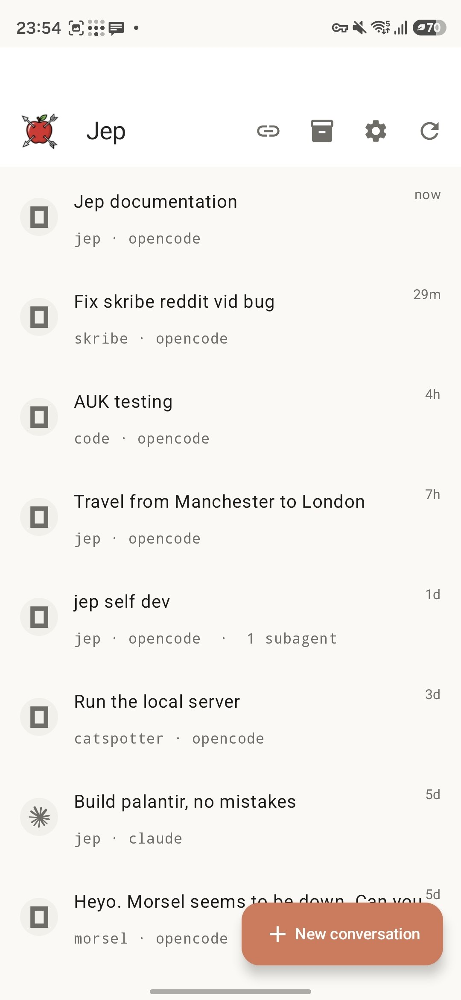</td>
    <td align="center">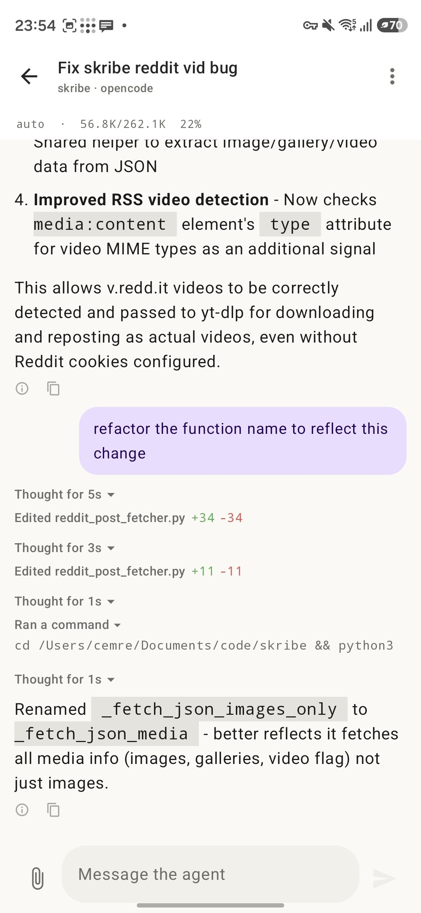</td>
    <td align="center">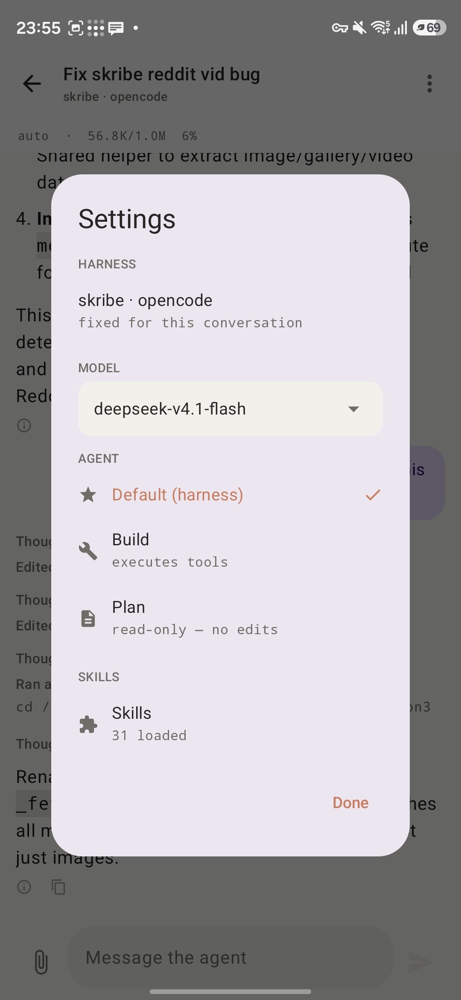</td>
    <td align="center">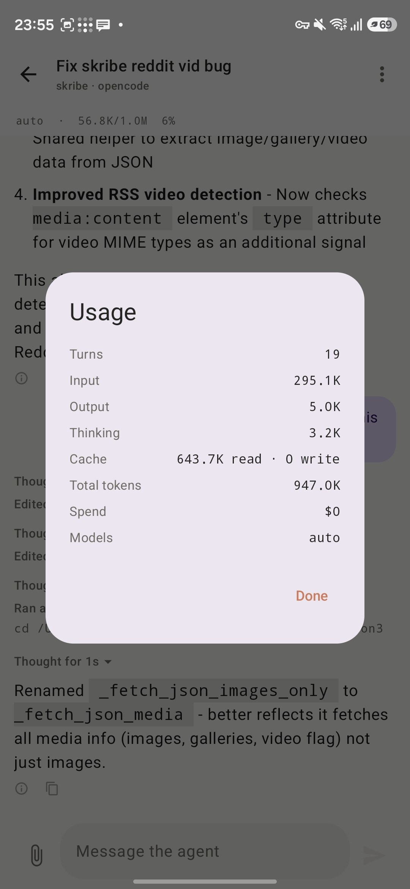</td>
  </tr>
  <tr>
    <td align="center"><sub>Conversations</sub></td>
    <td align="center"><sub>A streaming turn</sub></td>
    <td align="center"><sub>Settings</sub></td>
    <td align="center"><sub>Usage</sub></td>
  </tr>
  <tr>
    <td align="center">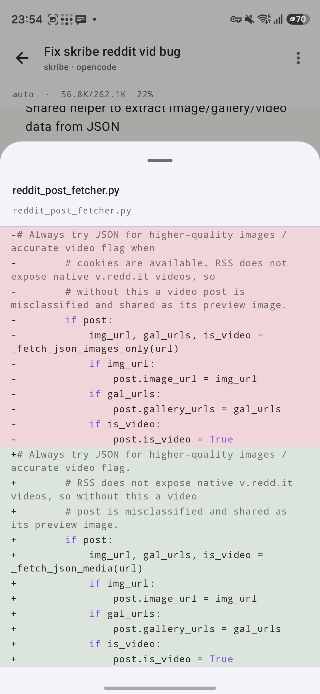</td>
    <td align="center">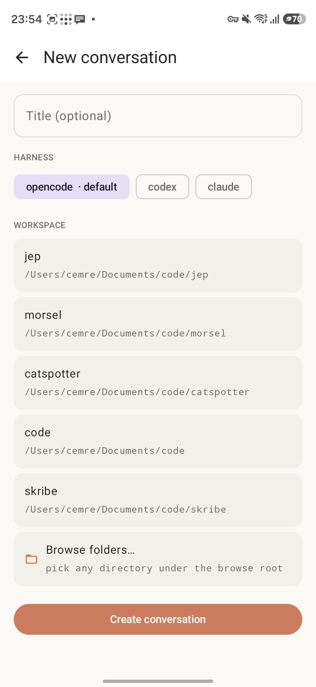</td>
    <td align="center">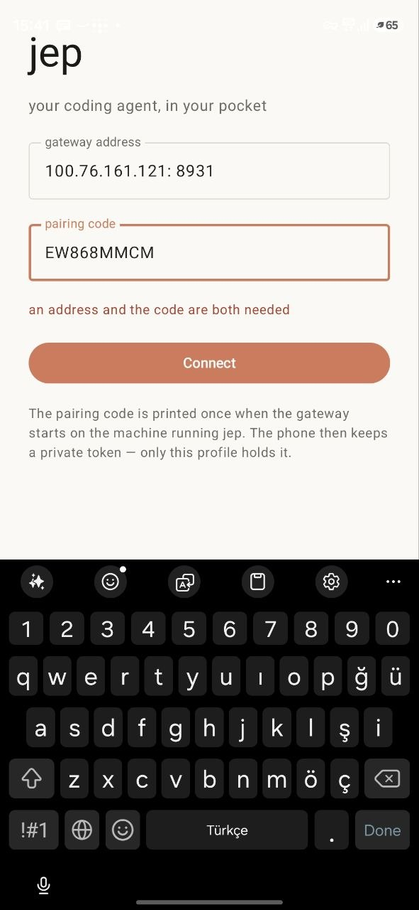</td>
    <td align="center">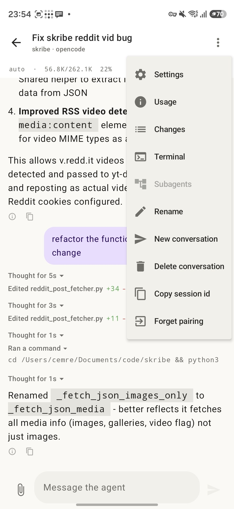</td>
  </tr>
  <tr>
    <td align="center"><sub>Diffs</sub></td>
    <td align="center"><sub>New conversation</sub></td>
    <td align="center"><sub>Pairing</sub></td>
    <td align="center"><sub>Actions</sub></td>
  </tr>
  <tr>
    <td align="center">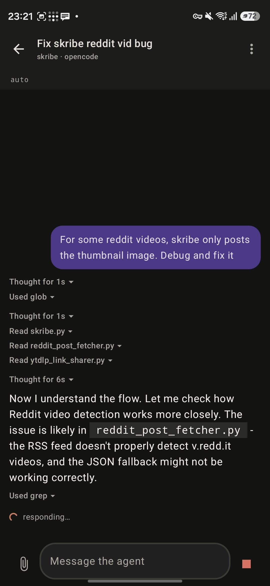</td>
    <td align="center">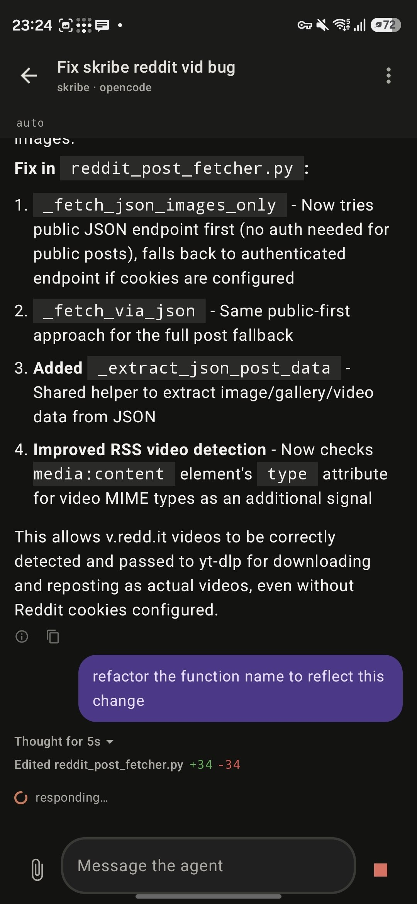</td>
    <td align="center">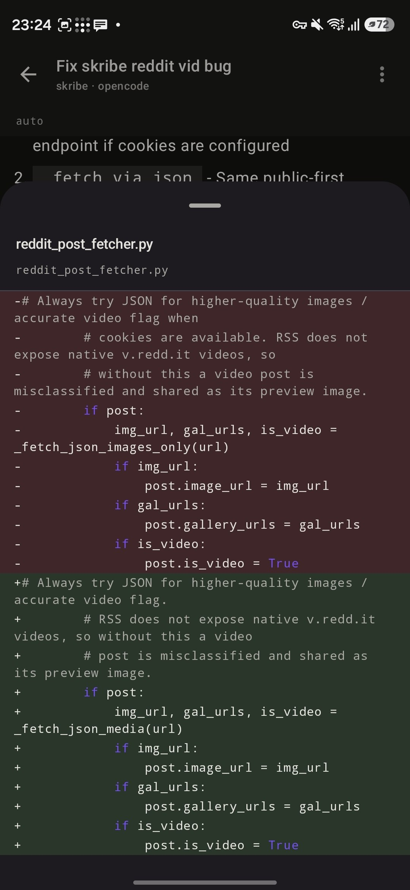</td>
    <td align="center">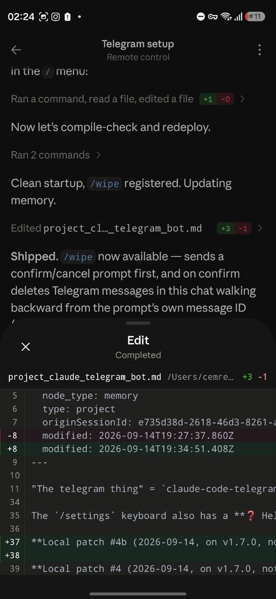</td>
  </tr>
  <tr>
    <td align="center"><sub>Turn in flight</sub></td>
    <td align="center"><sub>A finished turn</sub></td>
    <td align="center"><sub>Diffs</sub></td>
    <td align="center"><sub>Edits</sub></td>
  </tr>
</table>

## Requirements

- the jep daemon running with the **gateway** enabled (see below)
- a network path to your machine: Tailscale, a VPN, or the LAN
- Android Studio (or just a JDK + the Android SDK) to build the app

## Setup

### 1. Start the daemon with the gateway on

The gateway is an HTTP + SSE door the app talks to. Enable it with
`JEP_GW_PORT`; pick a pairing code so the app can authorize itself:

```sh
export JEP_WORKSPACES="$HOME/your-project"
export JEP_GW_PORT=8080            # the port the app will reach
export JEP_GW_PAIR_CODE=pickme     # 1st unlock; a code also prints at boot

npm start
```

The gateway binds 0.0.0.0, so a phone reaches it over Tailscale, a VPN, or
the LAN. The current pairing code is also readable any time with `npm run pair`
(see the [gateway docs](../GATEWAY.md) for every endpoint).

### 2. Build the app

```sh
cd android
./gradlew app:assembleDebug
```

Install the APK on your phone (Android Studio or `adb install`).

### 3. Pair & talk

- Open the app, enter your machine's address and the pairing code. In
  Tailscale that's `http://<machine-name>:8080`.
- The app lists your conversations (including ones on the desktop that jep has
  already indexed), streams live turns, and notifies you when a session goes
  idle or asks you something.
- **Terminal** is an opt-in superpower: prove the pairing code a second time in
  Settings to unlock a tmux shell in the conversation's workspace.

## What the app has

- **Sessions**: every conversation across every project, with search and
  filtering.
- **Chat**: streaming replies, collapsible thinking/tool calls, file transfers,
  ephemeral asks with tap-to-answer buttons.
- **New conversation**: pick a workspace, a harness, and a title.
- **Settings**: connection, model, notify policy (idle / asked / both), MCP
  servers, skills, and the terminal unlock.
- **Notifications**: from the SSE stream the app keeps open, so a finished turn
  or a pending ask surfaces without the app being foreground.

The full gateway surface and its JSON contract:
[docs/GATEWAY.md](../GATEWAY.md).