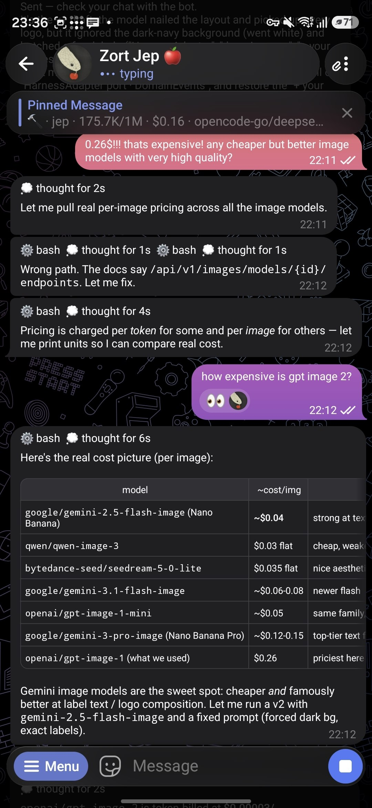
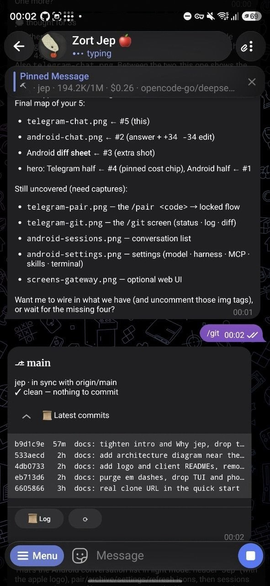
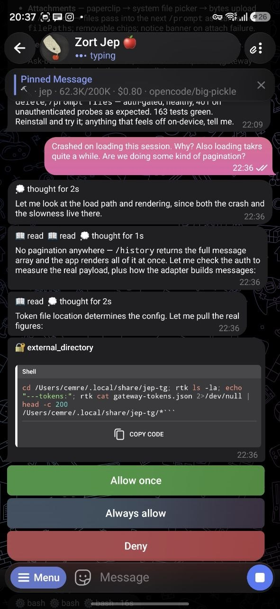
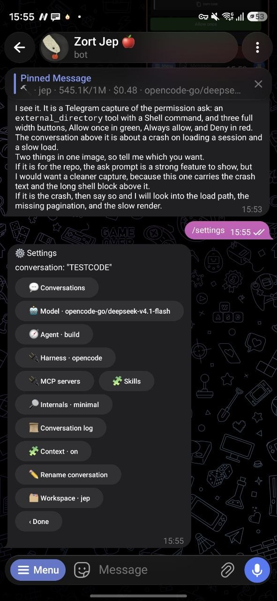

# Telegram client

jep as a Telegram bot: pair it from your chat, then text it. Rich native
messages, voice notes, git and usage screens, and a streaming stop/steer loop.

<table>
  <tr>
    <td align="center"></td>
    <td align="center"></td>
    <td align="center"></td>
    <td align="center"></td>
  </tr>
  <tr>
    <td align="center"><sub>A rich reply, cost chip pinned above</sub></td>
    <td align="center"><sub>The /git screen</sub></td>
    <td align="center"><sub>A permission ask</sub></td>
    <td align="center"><sub>The /settings menu</sub></td>
  </tr>
</table>

## Requirements

- the jep daemon running (see [the README](../README.md#quick-start))
- a bot token from [@BotFather](https://t.me/BotFather)

## Setup

Two things, then you're paired.

### 1. Start the daemon with your token

```sh
export JEP_TG_TOKEN=123456:ABC-DEF...   # from @BotFather
export JEP_WORKSPACES="$HOME/your-project"

npm start
```

> On macOS, `sh scripts/install.sh` installs it as a **launchd daemon** that
> survives reboots and crashes; see [docs/PROCESSES.md](../PROCESSES.md).
> For a quick dev loop, `npm start` is all you need.

### 2. Pair your chat

The daemon mints a one-time **pairing code** at boot (pin your own with
`JEP_TG_PAIR_CODE`). Read the current code any time with:

```sh
npm run pair
```

Then, in your chat with the bot, send:

```
/pair <code>
```

The bot locks to that chat, and plain text from then on is a prompt. An
unpaired chat is never told the code (that would leak it), so `/pair` on its own
just prompts you for it. The code is single-use: a fresh one is minted the
moment it works. The owner is persisted, so restarts keep ownership.

Once paired, `/pair_status` shows the owner and the current code.

## Commands

| Command | What it does |
|---|---|
| `text` | a prompt on the current conversation |
| `voice note` | transcribed with whisper, then run as a prompt |
| `/pair <code>` | lock the bot to this chat |
| `/pair_status` | owner, paired chats, current code |
| `/new <title>` | start a new conversation |
| `/ls` | list every conversation, across all projects |
| `/use <title\|id>` | switch to another conversation |
| `/log` | this conversation's history |
| `/diff` | files changed this session |
| `/git` | repo screens: status, log, diff |
| `/queue` | what is running, what is waiting |
| `/steer <text>` | stop the running turn and send that text ahead of the queue |
| `/abort` | stop the turn in flight |
| `/find <text>` | search titles and recent transcripts |
| `/usage` (alias `/cost`) | spend by the harness itself: tokens, model, USD |
| `/remind <5s to 7d> <what>` | a silent nudge (recurring: `every <d>`) |
| `/settings` | rich menu: model, harness, workspace, internals, MCP, skills |
| `/ws <name>` | switch workspace |
| `/cancel` | back out of a pending prompt |
| `/help` | the command list |

`mdl:<model>` as a message pins a model for the conversation (`mdl:off` to
return to the default).

## How it feels

- Turns stream into an animated **draft** with a native **Stop** button, a 💭
  line while the model reasons, and collapsible tool calls.
- Tables render as native rich blocks or box-drawn HTML, whichever your client
  supports. There is no scenario where a reply fails to send.
- Pictures and documents land as fluent uploads; the bot tells you when the
  default model can't read them and offers vision-capable ones.
- **Asks** (permission prompts, questions the model asks) arrive as buttons you
  tap; the safe answer is green, the destructive one red.

The full surface, environment variables, and deploy ritual live in
[docs/PROCESSES.md](../PROCESSES.md).